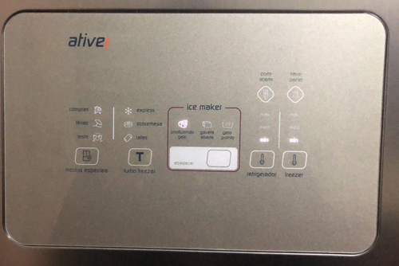
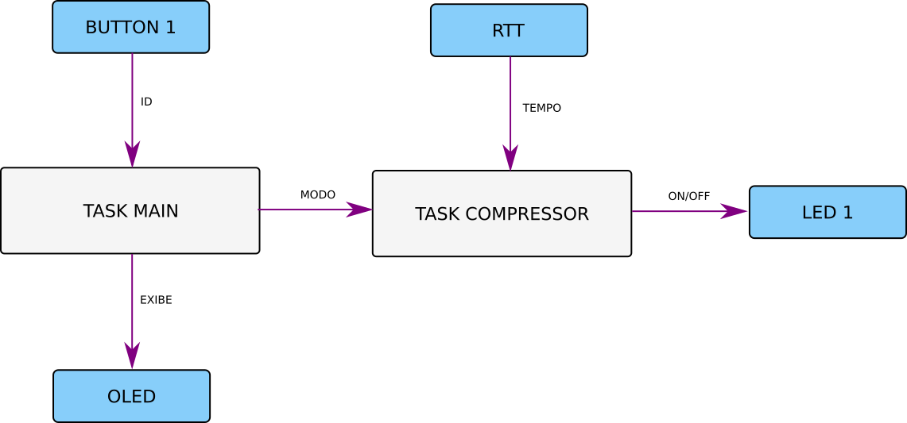

# 21a - Avaliação Prática Substitutiva 

Leia atentamente as informações:

1. Atualize o arquivo `ALUNO.json` com seu nome e e-mail e faça um commit imediatamente.
1. **Faça o seu trabalho de maneira ética!**
1. **A cada 30 minutos você deverá fazer um commit no seu código!**
    - Códigos que não tiverem commit a cada 30min ou que mudarem drasticamente entre os commits serão descartados (conceito I) !!
    - Você deve inserir mensagens condizentes nos commits!
1. Duração: 3h
1. Usar o código exemplo deste repositório, ele já possui:
    - botões com interrupção
    - leds 
    - diplay do módulo OLED1
    - TC/ RTT e RTC adicionados no wizard

:triangular_flag_on_post: **Ao finalizar a entrega preencher o formulário (uma única vez!):TODO**

Utilize o projeto exemplo que se encontra neste repositório.



## Requisitos

A ideia é desenvolver o sistema de controle da refrigeracão e a interface com o usuário de uma geladeira, para isso iremos utilizar o OLED e o SAME70-XPLD. Os principais pontos do dispositivo são:

- Possibilitar que usuário configure o modo de operação da geladeira.
- Controlar o tempo que o compressor fica ligado com base no modo de operacão.

**Você deve sempre que possível utilizar recursos do RTOS, não pode fazer uso de variáveis globais que não as do RTOS.**

A seguir detalhes do requisito de projeto.



#### Modos de operação

O usuário deve ser capaz de selecionar um dentre os seguintes modos de operação da geladeira:

1. NORMAL
1. ECO
1. TURBO
1. FESTA

A escolha do modo de operação deve ser feita feita via botão 1 da placa OLED e exibido no OLED, os modos devem ser apresentados de forma cíclica ( NORMAL -> ECO -> TURBO -> FESTA -> NORMAL ). 

O modo de operação será controlada pela `task_main` que exibirá o modo atual no OLED e se comunicará a `task_compressor` de qual modo foi escolhido.

A escolha do modo de operação só deve ser efetivamente selecionada depois que o usuário ficar parado por um tempo no mesmo modo. Ao efetivar a escolha do modo um '*' deve aparecer no OLED.

Firmware:

- OLED BUTTON 1.
- Deve ser implementado na `task_main`.
- IRQ de botão / Usar fila ou semáforo.
- **Efetivar escolha do modo apenas quando ficar parado no modo.**

Dicas:

- Lembrar de apagar antes de escrever.
- Criar um vetor de strings pode ajudar. 

#### Compressor

O controle do compressor será representado pelo LED 1 da placa OLED (aceso = ligado, apagado = desligado) e será realizado de duas maneiras:

- Tempo que fica ligado
- Tempo que fica desligado

O controle do compressor será realizado por uma outra task: `task_compressor` que irá receber o modo atual de operação via uma fila (enviada da task `main`) e irá informar a `task_main` ....

Conforme ilustrado a seguir cada modo de operação da geladeira terá uma configuração diferente de quanto tempo o compressor fica ligado e desligado, é responsabilidade da `task_compressor` gerenciar isso com auxilio do RTT.

| Modo   | Tempo Ligado | Tempo Desligado |
| ----   | -----        | ------          |
| NORMAL | 3s           | 3s              |
| ECO    | 1s           | 5s              |
| Turbo  | 5s           | 3s              |
| Festa  | 5s           | 1s              |

> O tempo sem segundos é para facilitar o desenvolvimento, o correto seria pensar em minutos, mas seria dificil debugar.

Exemplo: Se o modo de operação escolhido é o NORMAL, o LED 1 deve ficar aceso por 5s e então apagar por 10s e então acender por mais 5s ...

Firmware:

- Implementar em uma nova task: `task_compressor`.
- Receber modo de operação atual da `task_main`.
- O LED 1 aceso indica que o compressor está ligado.
- Usar o RTT para a contagem de tempo.
- Controlar o LED de acordo com tabela de modos de operação.

Dicas:

- Adicionar RTT no wizard
- Fazer por partes
- Criar struct para ajudar organizar modo X tempos
- Criar vetor de struct

### Itens extras 

Os itens a seguir fornecem meio ou um conceito a mais, você pode escolher qual quer fazer.

- (`+meio`) Verificar abertura de porta e gerar alarme.
- (`+meio`) PWM para controle extra do compressor
    - (`+meio`) Se usar periférico PWM
- (`+meio`) Exibir um relógio.
- (`+meio`) Modo alarme Festa e Turbo
- (`+meio`) Exibir no OLED informação que o compressor está ligado

A seguir mais detalhes de cada modo:

#### Verificar abertura de porta e gerar alarme

Simular a abertura de porta pelo BUTTON 3 da placa OLED, se o botão 3 estiver pressionado indica que a porta está aberta. Se a porta ficar aberta por mais de 10 segundos, exibir no OLED que a porta está ABERTA.

#### PWM para controle extra do compressor

Além do tempo que o compressor fica ligado podemos controlar a potência do compressor através de um sinal PWM, implemente o PWM no compressor seguindo a tabela a seguir:

| Modo   | PWM   |
| ----   | ----- |
| NORMAL | 50%   |
| ECO    | 50%   |
| Turbo  | 100%  |
| Festa  | 80%   |

Lembre que um PWM é uma onda do tipo mostrado a seguir, o efeito que vocês devem observar é do LED piscando dentro do tempo que ele está ligado.

``` 
        80% em alto
        |--------|
        
     ---------------              ----- s
    |***************|            |******s 
    |***************|            |******s 
____|***************|____________|******s 
```

#### Periférico PWM

Usar o periférico dedicado de PWM do microcontrolador para gerar o PWM, tem um exemplo no repositório de exemplos:

- https://github.com/Insper/SAME70-examples/tree/master/Perifericos-uC/PWM-LED

#### Exibir um relógio

Exibe um relógio no OLED atualizado a cada um segundo.

#### Modo alarme Festa e Turbo

Quando passado 10 ciclos de operação nos modos FESTA e TURBO exibe para
o usuário uma mensagem no OLED indicando Alarme, o alarme some quando o 
usuário mudar para o modo de operação NORMAL ou ECO.

#### Exibir no OLED informação que o compressor está ligado

Além do LED1 exibir no OLED quando o compressor está ligado. Você não pode atualizar o OLED na task compressor, deve enviar a informação de volta para a task main.
